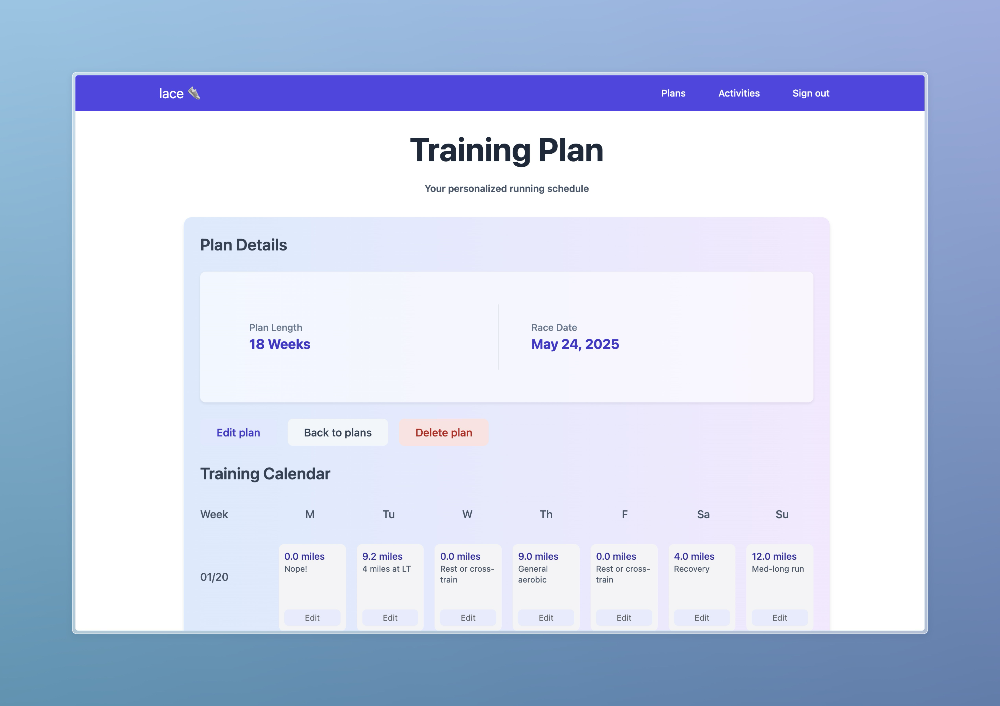

# Lace 🪢

A simple training app for runners to plan their next race. 

### Currently implemented features:

**Build a training plan from a pre-set 18-week plan for the marathon** 
  - Automatically builds the plan based on race date. 
  - Edit works, and drag and drop runs to different days in the week. 

**Import historical Strava activities**
  - Compare activities to similar activities using embeddings LLM. 
  - Search for activities using natural language.

